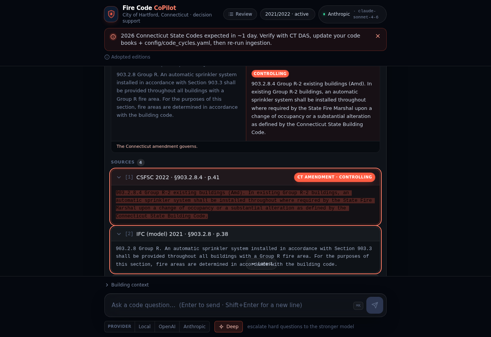
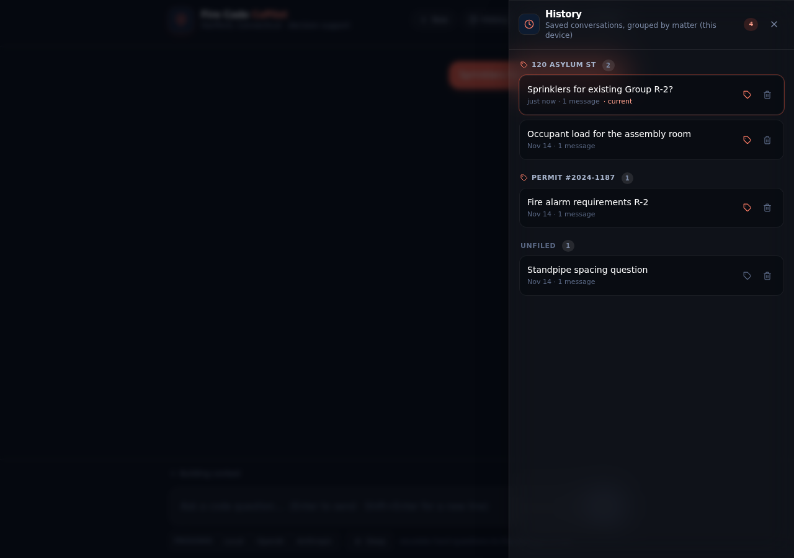
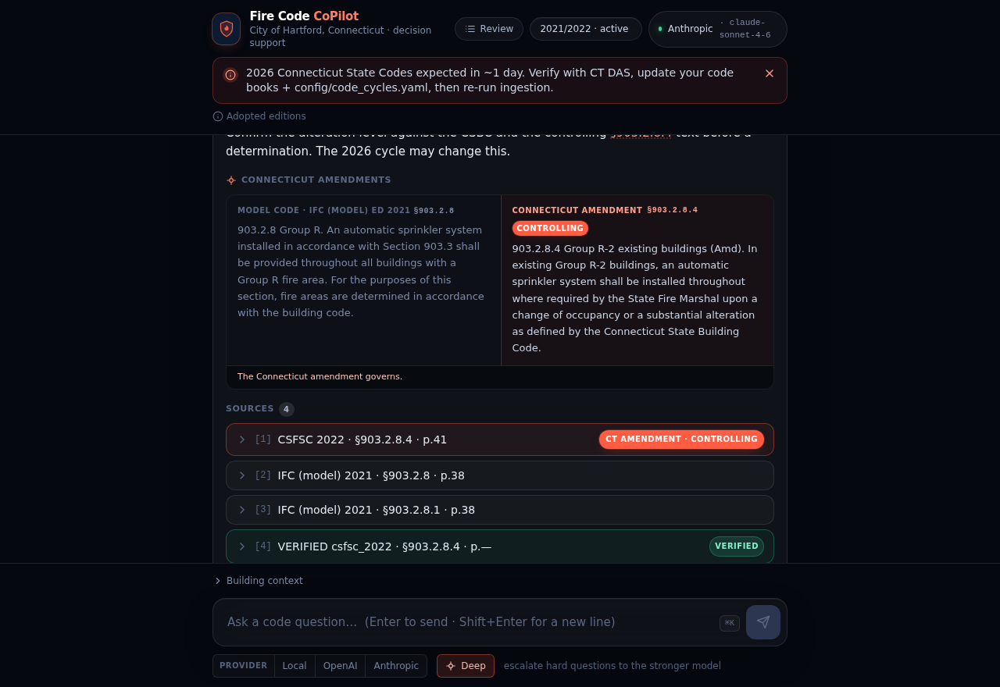
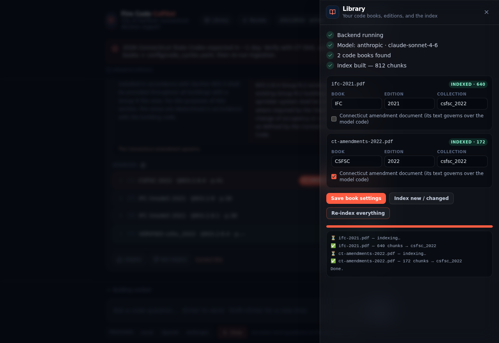
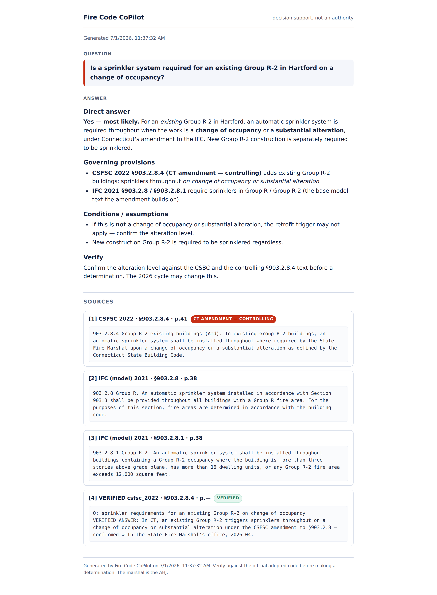

<div align="center">

# 🔥📖 Fire Code CoPilot

**A local-first, private AI research assistant for fire code work in the City of Hartford, CT.**

Ask questions in plain language instead of digging through code books — it finds the governing
section in *your own* books, respects Connecticut's amendments, streams a cited answer, and shows
you the exact source text so you can verify.

</div>


> ⚠️ **Personal-use, decision-support tool.** Your code books are copyrighted; this app keeps them
> on *your* machine and never publishes or redistributes them. **You** remain the Authority Having
> Jurisdiction — always verify against the official adopted code before making a determination.

---

## What it does

- 📚 **Indexes your own code books** (ICC I-Codes, NFPA, and the Connecticut amendments) — with
  section-aware chunking so citations land on the right section.
- 💬 **Answers in plain English**, streaming token-by-token, e.g. *"Sprinkler requirements for an
  existing 3-story Group R-2?"*
- 🇨🇹 **Connecticut governs.** It prioritizes the adopted/amended CT version over the base model
  code, and shows the model text **beside** the controlling amendment.
- 🔖 **Cites the exact section and page**, and shows the quoted source so you can verify at a glance.
  It **refuses to fabricate** — every claim is checked against your books.
- 🔗 **Click any citation to verify** — jump straight to the matching source and highlight the exact
  line the answer is built on, or open the **actual typeset page** of the book beside it.
- 🧠 **Remembers the conversation** — follow-ups like *"what about existing buildings?"* retrieve and
  answer with the topic they refer to.
- 📖 **Built-in Library** — a setup checklist, per-book edition settings, and re-indexing with a live
  progress bar. Plus one-command **backup/restore** of everything the tool has learned from you.
- 🧭 **Asks the right follow-up questions** (occupancy, new vs. existing, sprinklered…) before
  committing, and shows a **confidence** chip on every answer.
- 🗂️ **Organize by "matter"** — file conversations under a street address or permit # so a job's
  questions stay together.
- 📚 **Search a legacy edition** when you need it (existing-building work) with the cross-edition
  selector — the active adopted edition stays the default.
- 📈 **Learns from you** — 👍/👎 and "Save as verified answer" build a memory that sharpens future
  answers; weak answers auto-land in a review queue.
- 🗓️ **Tracks the adopted code cycle** and warns you when a new one is due.
- 🔒 **Private by default.** Runs fully local (embeddings + optional local LLM). Only your question
  and small retrieved snippets ever leave the machine — and with a local model, nothing does.
- 🖥️ **Runs as a native desktop app** (Tauri) that embeds the backend — or in your browser.

## See it in 10 seconds (no setup)

Run the UI in **demo mode** — it uses built-in sample data, no backend and no code books:

```bash
cd fire-code-copilot/frontend && npm install && npm run dev
# then open http://localhost:5173/?demo in your browser
```

## Screenshots

| Cited answer + confidence | Click a citation → jump to & highlight the source |
|---|---|
|  |  |
| **Model-vs-CT amendment diff** | **Saved "matters" — grouped by address / permit #** |
|  |  |
| **Search a legacy edition** | **Expand any source** |
|  |  |
| **Asks clarifying questions** | **Review + Verified ("Marshal desk")** |
|  |  |
| **The Library — books, editions, indexing with live progress** | **Export answer + citations** |
|  |  |
| **Mobile** | |
|  | |

## Get it running on your Mac Studio

The code lives in **[`fire-code-copilot/`](fire-code-copilot/)**. The
**[full step-by-step install guide (explained like you're 5, with screenshots)](fire-code-copilot/README.md)**
walks you through it — install the tools, point it at your PDF folder, pick a model (Claude key or
fully-local Ollama/GGUF/MLX), index your books, and start it. There's also a section on
**using it from your phone** securely (via Tailscale).

Short version:

```bash
git clone https://github.com/classamusic-spec/FIRECODECOPILOT.git
cd FIRECODECOPILOT/fire-code-copilot

# Backend
cd backend && python3 -m venv .venv && source .venv/bin/activate
pip install -r requirements.txt && cp ../.env.example ../.env   # then set CODE_BOOKS_DIR + a model
python -m app.ingest --inspect     # look at how your books split
python -m app.ingest               # index them
uvicorn app.main:app --reload      # start the API (Terminal 1)

# Frontend (Terminal 2)
cd ../frontend && npm install && npm run dev   # open the printed http://localhost:5173
```

## How it works

```
code_books/*.pdf ─► ingest (section-aware chunking, per-edition collections)
                     └─► local embeddings ─► ChromaDB (hybrid BM25 + dense retrieval)
                                              └─► CT amendment merge ─► reranker
query ─► retrieve ─► agent (local model OR Claude) ─► streamed, citation-validated answer
         feedback / verified answers ─► SQLite + a Verified Answer Library (compounding memory)
```

- **Backend:** Python + FastAPI · ChromaDB · PyMuPDF · sentence-transformers · rank-bm25
- **Models:** any of **Claude API**, **OpenAI API**, **Ollama / LM Studio**, a local **GGUF**
  (llama.cpp), or **MLX** (Apple Silicon) — switched with one env var.
- **Frontend:** React + Vite + Tailwind (a premium navy/coral "navy cockpit" theme).
- **Tests:** an offline suite (chunking, retrieval, citations, streaming, API) + a golden **eval**
  harness with an optional **LLM-judge** tier.

## Documentation

| File | What's in it |
|---|---|
| [`fire-code-copilot/README.md`](fire-code-copilot/README.md) | Full Mac Studio install & run guide (+ phone access) |
| [`docs/ARCHITECTURE.md`](fire-code-copilot/docs/ARCHITECTURE.md) | How it all fits together |
| [`docs/PROJECT_SPEC.md`](fire-code-copilot/docs/PROJECT_SPEC.md) | Requirements + the learning loop |
| [`docs/ROADMAP.md`](fire-code-copilot/docs/ROADMAP.md) | What's shipped and what's next |
| [`docs/LOCAL_MODELS.md`](fire-code-copilot/docs/LOCAL_MODELS.md) | Running fully local (server / GGUF / MLX) |
| [`docs/COPYRIGHT_AND_LICENSING.md`](fire-code-copilot/docs/COPYRIGHT_AND_LICENSING.md) | Legal guardrails |
| [`docs/MONETIZATION_PLAN.md`](fire-code-copilot/docs/MONETIZATION_PLAN.md) | If this ever becomes a product: what's sellable, pricing, prerequisites |
| [`docs/HERMES_MCP.md`](fire-code-copilot/docs/HERMES_MCP.md) | Use it from Hermes / any MCP agent as a local tool |

---

<div align="center">
<sub>Decision support, not an authority. The marshal is the AHJ. Always verify against the official adopted code.</sub>
</div>
