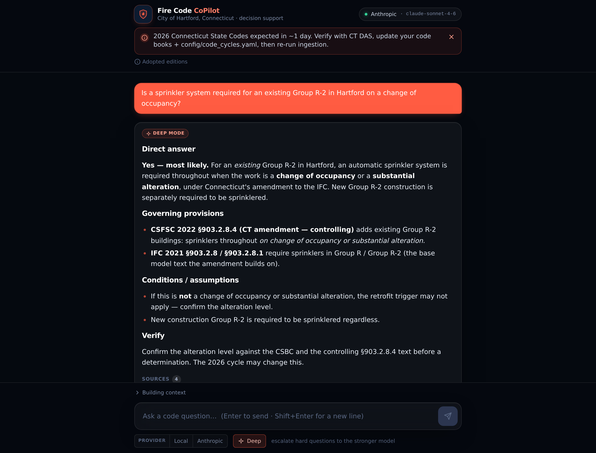
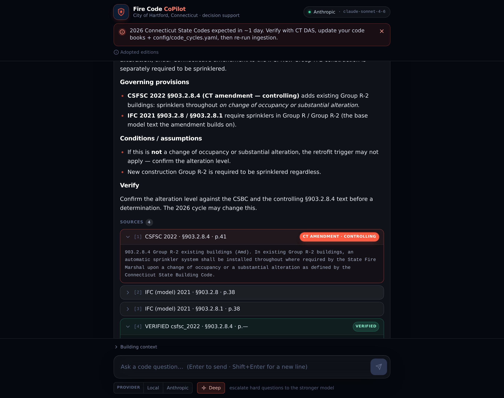
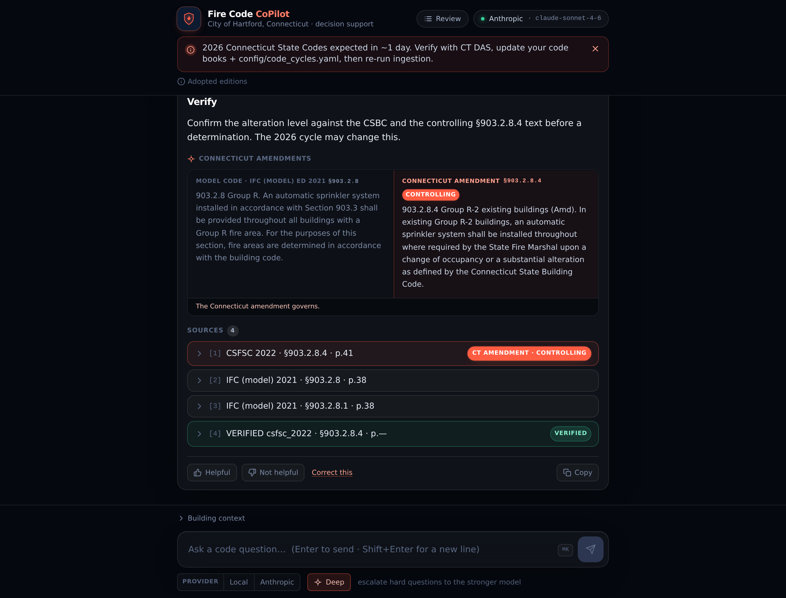
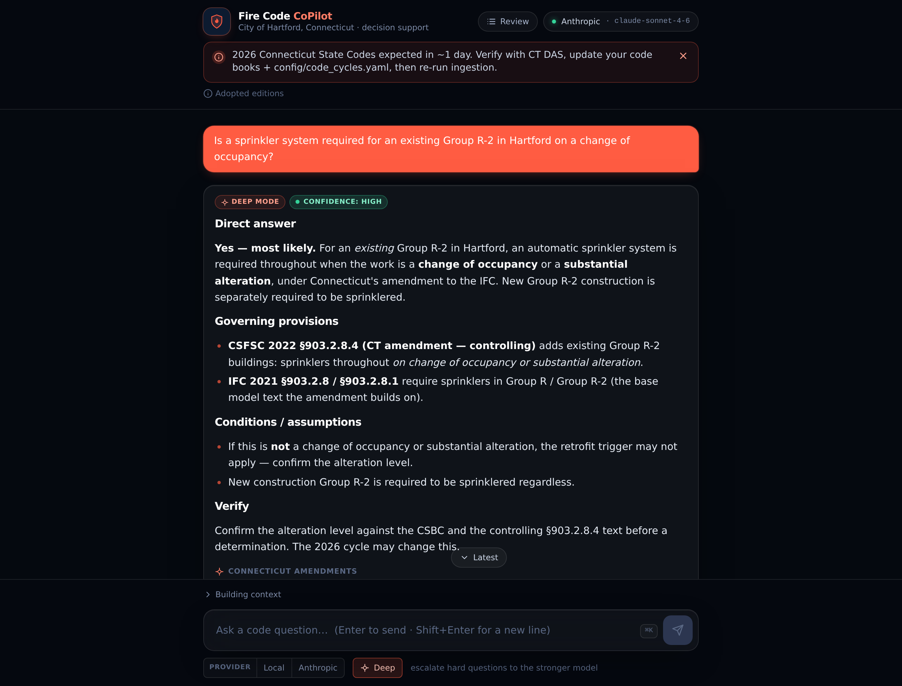
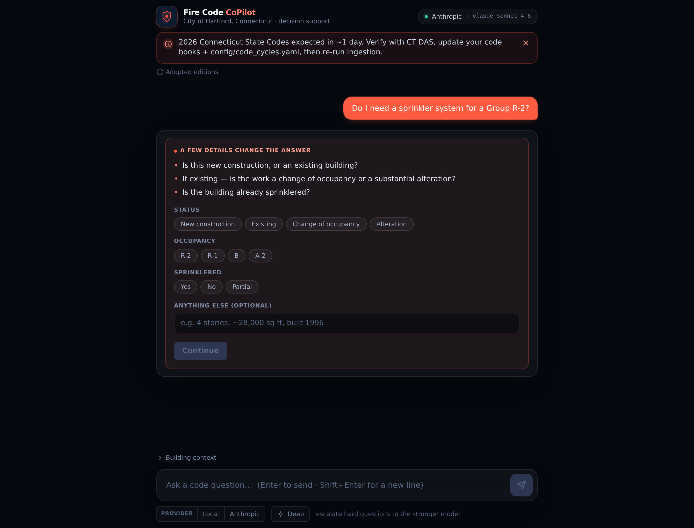
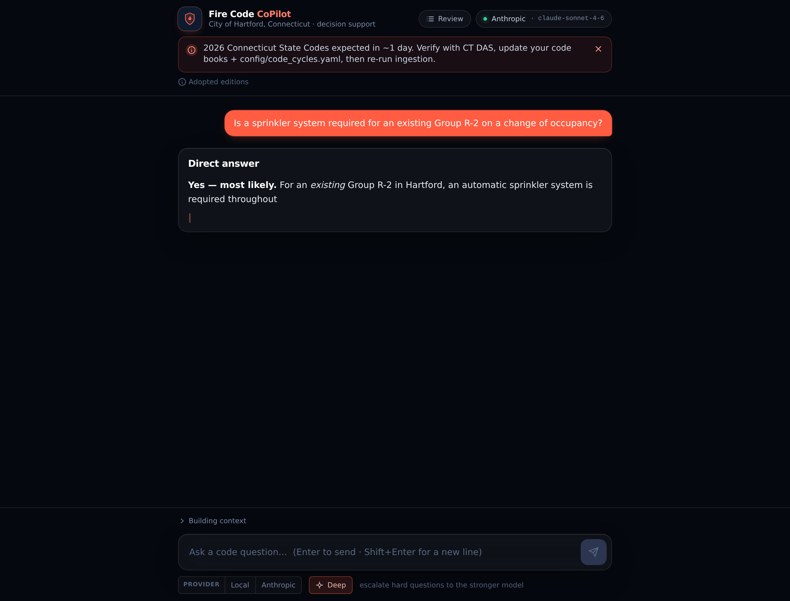
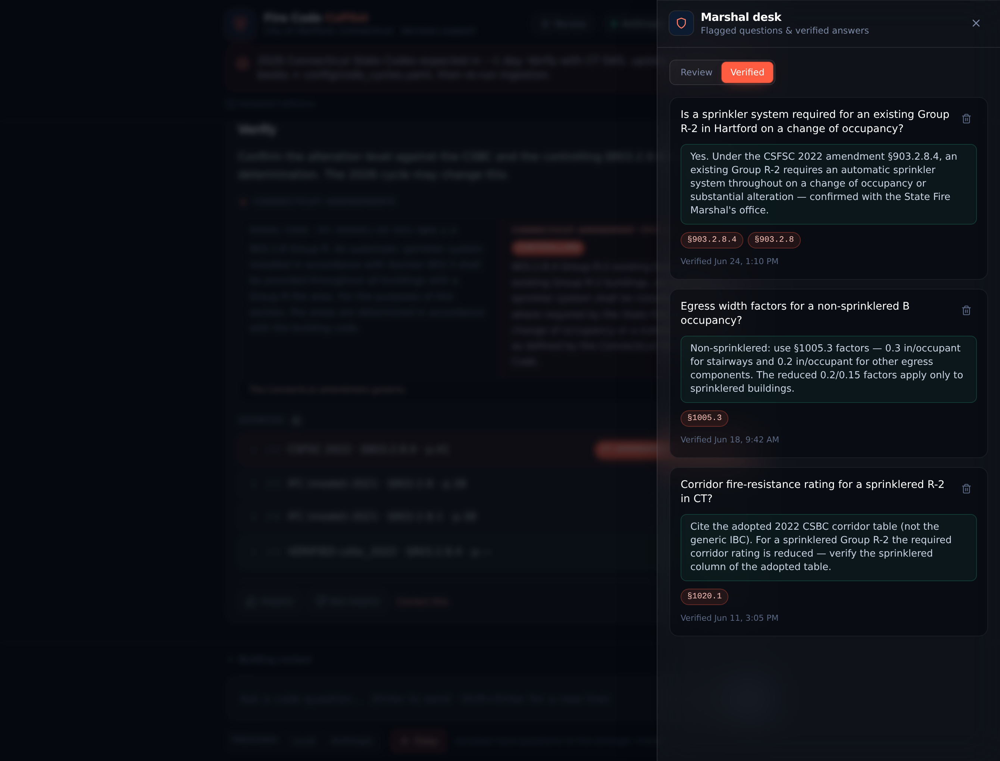
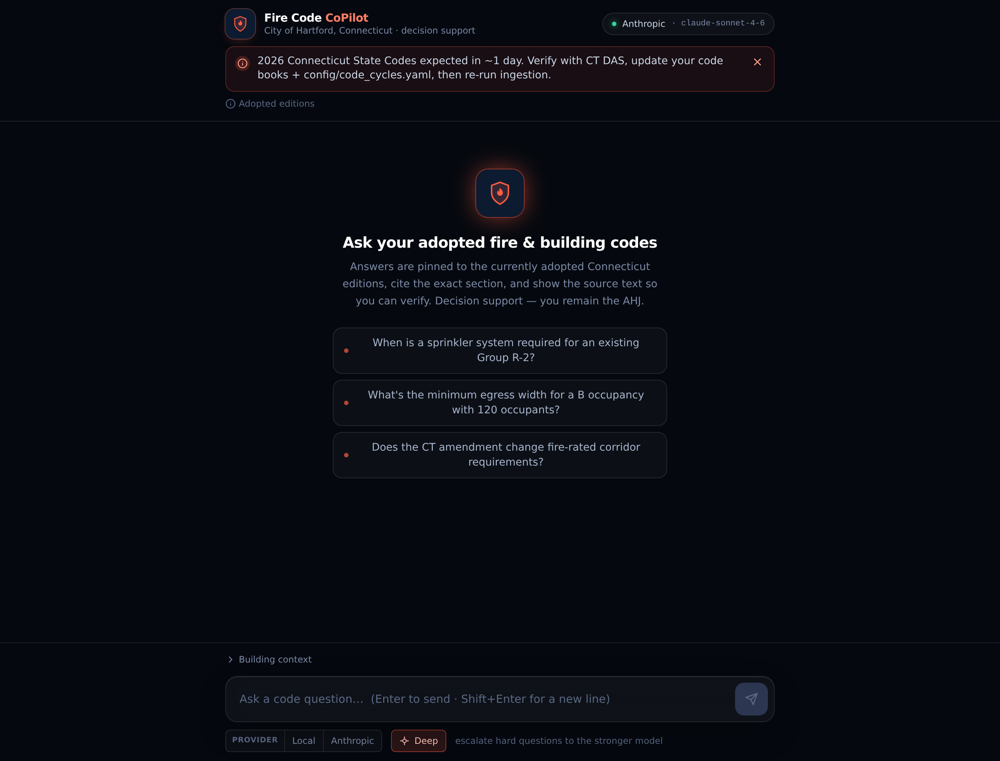
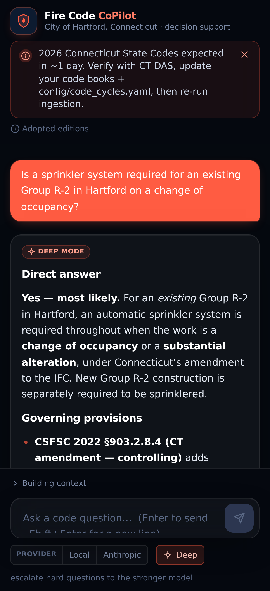

# Fire Code CoPilot 🔥📖

A **personal AI research assistant** for fire code work in the **City of Hartford, CT**.
Ask questions in plain language instead of digging through code books — it finds the governing
section in *your own* books, respects Connecticut's amendments, and shows you the exact source
text so you can verify.

> ⚠️ **Personal-use tool.** Your code books are copyrighted. This app keeps them on *your*
> machine and never publishes or redistributes them. It's a research aid — **you** remain the
> Authority Having Jurisdiction. Always verify against the official adopted code before making a
> determination. See `docs/COPYRIGHT_AND_LICENSING.md`.



<details>
<summary><b>More screenshots</b> — sources, amendment diff, confidence, clarifying questions, review/verified, streaming, mobile</summary>

| | |
|---|---|
| **Sources** — click any citation to read the exact code text; controlling CT amendment (coral) + verified (green) |  |
| **Model-vs-CT amendment diff** — see the base model code beside the controlling Connecticut amendment |  |
| **Confidence** — a High/Medium/Low chip on every answer |  |
| **Asks clarifying questions** when the answer depends on specifics |  |
| **Streaming** — answers type out live, with a Stop button |  |
| **Review + Verified** — flagged questions and your confirmed answers, with delete |  |
| **Empty / first run** |  |
| **Mobile** |  |

</details>

---

# Install & run on a Mac Studio — explained like you're 5

You'll do this **once**, and it takes about **30 minutes** (most of that is the computer
downloading things). Copy-paste each block into the **Terminal** app (press `⌘ + Space`, type
"Terminal", hit Enter). After pasting a block, press **Enter** and wait for it to finish before
the next one.

> Throughout, lines starting with `#` are just notes — you can paste them too, they do nothing.

## What you need first
- A **Mac Studio** (any recent one is plenty).
- Your **fire/building code book PDFs** in a folder somewhere (e.g. `~/Documents/CodeBooks`).
- About **30 minutes** and a Wi-Fi connection.

---

## Step 1 — Install the basic tools (Homebrew, Python, Node, Git)

"Homebrew" is the Mac app-store-for-developers. It installs the other three.

```bash
# Install Homebrew (paste the whole line). If it asks for your Mac password, type it (you won't see it) and press Enter.
/bin/bash -c "$(curl -fsSL https://raw.githubusercontent.com/Homebrew/install/HEAD/install.sh)"

# Tell your Terminal where Homebrew lives (Apple-Silicon Macs):
echo 'eval "$(/opt/homebrew/bin/brew shellenv)"' >> ~/.zprofile
eval "$(/opt/homebrew/bin/brew shellenv)"

# Now install Python, Node, and Git:
brew install python node git
```

✅ **Check it worked:** run `python3 --version` — you should see `Python 3.11` or higher.

---

## Step 2 — Download Fire Code CoPilot

```bash
# Put it in your home folder:
cd ~
git clone https://github.com/classamusic-spec/FIRECODECOPILOT.git
cd FIRECODECOPILOT/fire-code-copilot
```

(From now on, every command assumes you're in this `fire-code-copilot` folder. If you open a new
Terminal later, run `cd ~/FIRECODECOPILOT/fire-code-copilot` first.)

> ### ⚡ Shortcut: one command does it all
> Once the tools are installed (Step 1) and you've cloned (Step 2), you can skip Steps 3–7 and
> just run:
> ```bash
> bash scripts/launch.sh
> ```
> The **first time**, it sets up everything and creates your `.env`, then stops and asks you to
> fill in two things — your **code books folder** and a **model** (see Steps 4–5 below for what to
> put). Run `bash scripts/launch.sh` **again** and it installs the rest, warms the models, starts
> the API + web UI, and opens your browser. Press `Control-C` once to stop. The steps below explain
> everything the launcher does, in case you'd rather do it by hand.

---

## Step 3 — Set up the "engine" (the backend)

```bash
cd backend
python3 -m venv .venv          # makes a private sandbox for this app's Python bits
source .venv/bin/activate      # step into the sandbox (do this whenever you open a new Terminal)
pip install -r requirements.txt   # downloads the app's parts — takes a few minutes
cd ..                          # back to the fire-code-copilot folder
```

✅ You'll know the sandbox is active when your Terminal line starts with `(.venv)`.

---

## Step 4 — Point it at your code books

Make your settings file from the template:

```bash
cp .env.example .env
open -e .env                   # opens .env in TextEdit
```

In the TextEdit window, find the line `CODE_BOOKS_DIR=./code_books` (add it if it's not there)
and change it to the **full path of your PDFs folder**, for example:

```
CODE_BOOKS_DIR=/Users/YOURNAME/Documents/CodeBooks
```

(Replace `YOURNAME` with your Mac username. Not sure of the path? In Finder, right-click your
folder → "Get Info" → look at "Where", or drag the folder into the Terminal to paste its path.)

Save the file (`⌘ + S`) and close TextEdit.

> **Optional but recommended:** label each book and mark the Connecticut amendment files so
> citations read nicely and CT amendments win. Make a file called `books.yaml` inside your code
> books folder — copy `code_books/books.yaml.example` for the format. You can skip this; the app
> guesses sensible defaults.

---

## Step 5 — Give it a "brain" (pick a model)

The app needs an AI model to write answers. **Pick ONE** path. (Either way, your full books never
leave your machine — only your question and a few short retrieved snippets are sent to the model,
and with a local model *nothing* leaves at all.)

### 🟢 Easiest — use Claude (cloud, best quality)
1. Get an API key from <https://console.anthropic.com> (create account → API Keys → Create Key).
2. `open -e .env` again and set these two lines:
   ```
   GENERATION_PROVIDER=anthropic
   ANTHROPIC_API_KEY=sk-ant-...paste-your-key-here...
   ```
   Save and close.

### 🟢 Or use OpenAI (cloud)
1. Get an API key from <https://platform.openai.com/api-keys>.
2. `open -e .env` and set:
   ```
   GENERATION_PROVIDER=openai
   OPENAI_API_KEY=sk-...paste-your-key-here...
   OPENAI_MODEL=gpt-4o
   ```
   Save and close.

### 🔒 Fully private — run the model locally on your Mac Studio
Your Mac Studio is powerful enough to run a good model with **zero cloud**. Easiest local option:
1. Install **Ollama**: `brew install ollama` then `ollama serve` (leave it running), and in
   another Terminal: `ollama pull qwen2.5:7b-instruct`.
2. `open -e .env` and set:
   ```
   GENERATION_PROVIDER=local
   LOCAL_BASE_URL=http://localhost:11434/v1
   LOCAL_MODEL=qwen2.5:7b-instruct
   ```
   (Prefer a downloaded **.gguf** file or an **MLX** model instead? See `docs/LOCAL_MODELS.md` —
   set `GENERATION_PROVIDER=llamacpp` or `mlx`. Run `python -m app.llm --check` to confirm it's
   wired up.)

> The **embeddings** model (which finds the right sections) runs locally by default and downloads
> automatically the first time (~2 GB). Just let it finish on the first run.

---

## Step 6 — Look at your books, then index them

First, a **dry run** that shows how the app split your books into sections — no waiting, nothing saved:

```bash
cd backend
python -m app.ingest --inspect
```

Skim the output. You want to see sensible section numbers (like `903.2.8`) and page numbers. If
you see a warning like *"section regex may not match this book's numbering,"* tell me and we'll
tune it — but most ICC/NFPA books work out of the box.

Happy? Now **index** them for real (this reads every book once and builds the search index):

```bash
python -m app.ingest          # first run also downloads the embeddings model (~2 GB)
cd ..
```

✅ It prints how many chunks it indexed per book. Re-running later only re-reads changed/new books.

---

## Step 7 — Start it and ask a question

You need **two** things running. Open **two Terminal windows** (or two tabs: `⌘ + T`).

**Terminal 1 — the engine:**
```bash
cd ~/FIRECODECOPILOT/fire-code-copilot/backend
source .venv/bin/activate
uvicorn app.main:app --reload --port 8000
```
Leave it running (it'll say "Application startup complete").

**Terminal 2 — the website:**
```bash
cd ~/FIRECODECOPILOT/fire-code-copilot/frontend
npm install          # first time only, ~1 minute
npm run dev
```
It prints a link like `http://localhost:5173`. **Open that in your browser** and ask away —
e.g. *"Is a sprinkler system required for an existing Group R-2 on a change of occupancy?"*

**When it's running and you ask a question, it looks like this** (the answer types out live,
cites the exact section, and shows a confidence chip):


Click any **source** to read the exact code text, and expand the **Connecticut amendments** panel
to see the model code beside the controlling CT amendment:


🎉 That's it. To stop either piece, click its Terminal and press `Control + C`.

> **Just want to see it first, with no setup?** Open the website with `?demo` on the end of the
> URL (e.g. `http://localhost:5173/?demo`) — it runs on built-in sample data with no backend or
> code books, so you can click around the whole UI.
>
> **Prefer not to use the website?** You can chat right in the Terminal instead:
> `cd backend && source .venv/bin/activate && python -m app.cli`

---

## Using it day to day

- **Ask** in plain English. Answers **stream in live**, and each one shows a **confidence** chip
  (High/Medium/Low). If the answer depends on specifics (occupancy, sprinklered, new vs. existing),
  it asks you first — tap the chips.
- **Every claim shows its source.** Click a citation to read the exact code text. When a section
  was amended, the **Connecticut amendments** panel shows the model code *beside* the controlling
  CT text. Coral = controlling **Connecticut amendment**; green = an answer **you verified** before.
- **Teach it.** 👍/👎 each answer. Hit "Correct this" to fix one, and "Save as verified answer"
  so the same question comes back right next time. The **Review** button (top-right) opens the
  *Marshal desk*: a **Review** tab (everything you flagged — weak answers auto-appear here) and a
  **Verified** tab (your confirmed answers, which you can delete if they go stale).
- **Keep your conversations.** They're saved locally — **New chat** starts a fresh one, and
  **History** lists your past conversations (nothing leaves your machine). Copy any answer with the
  **Copy** button, or press **⌘K** to jump to the question box.

## When you add books or a new code cycle arrives

1. Drop the new PDFs into your code books folder (and the CT amendment file).
2. (New cycle only) edit `config/code_cycles.yaml`: move `pending_cycle` → `active_cycle`, and set
   `ACTIVE_COLLECTION` in `.env` to the new cycle name. Each cycle is its own searchable
   collection, so old editions stay available for existing-building questions.
3. Re-run `cd backend && source .venv/bin/activate && python -m app.ingest`.
4. Run `bash scripts/check_containment.sh` to confirm nothing copyrighted is tracked by git.

---

## 📱 Use it from your phone (securely)

You want to ask questions from your phone in the field while the Mac Studio at the office does the
work. The safe way is **Tailscale** — a free app that creates a private network between *just your
own devices* (your books/snippets never touch the public internet).

**One-time setup:**
1. **On the Mac Studio:** `brew install --cask tailscale`, open the Tailscale app, and sign in
   (Google/Apple/email — remember which).
2. **On your phone:** install **Tailscale** from the App Store and sign in with the **same**
   account.
3. **On the Mac Studio**, find its private address:
   ```bash
   /Applications/Tailscale.app/Contents/MacOS/Tailscale ip -4
   ```
   It looks like `100.x.y.z`. Write it down.
4. Tell the website to talk to the Mac over that address. Edit `frontend/.env` (copy from
   `frontend/.env.example` if needed):
   ```
   VITE_API_BASE=http://100.x.y.z:8000
   ```
   (use your number from step 3).

**Each time you want to use it remotely**, start both pieces but listening on the network:

```bash
# Terminal 1 (engine), reachable on your private network:
cd ~/FIRECODECOPILOT/fire-code-copilot/backend && source .venv/bin/activate
uvicorn app.main:app --host 0.0.0.0 --port 8000

# Terminal 2 (website), reachable on your private network:
cd ~/FIRECODECOPILOT/fire-code-copilot/frontend
npm run dev -- --host
```

Now on your **phone's browser**, go to **`http://100.x.y.z:5173`** (your number, port 5173).
Add it to your home screen for an app-like icon.

> 💡 Keep the Mac awake so it can answer while you're out: run `caffeinate -s` in a third Terminal
> (Control-C to stop). And use the local-model option (Step 5) if you want it to work with no
> internet at all.
>
> 🔒 **Don't** use public tunnels (ngrok, etc.) for this — those expose your machine to the
> internet. Tailscale keeps it private to your own devices, which is what you want for
> copyrighted code text.

---

## If something goes wrong

| Problem | Fix |
|---|---|
| `command not found: brew` | Re-run the two `eval "$(/opt/homebrew/bin/brew shellenv)"` lines from Step 1, or close and reopen Terminal. |
| The website says "Could not reach the backend" | Make sure Terminal 1 (uvicorn) is still running. Remotely, check `VITE_API_BASE` matches your Tailscale IP. |
| "No PDFs found" | Double-check `CODE_BOOKS_DIR` in `.env` is the real full path to your folder. |
| Answers say "I couldn't find this in your loaded code books" | The topic may not be in the indexed books, or section detection needs tuning — run `python -m app.ingest --inspect` and share the output. |
| Ingest warns a book "needs OCR" | That PDF is scanned images (no selectable text). OCR it first: `brew install ocrmypdf` then `ocrmypdf "book.pdf" "book-ocr.pdf"`, put the OCR'd copy in your code books folder, and re-ingest. |
| Local model errors | Make sure `ollama serve` (or your model server) is running; or run `python -m app.llm --check`. |

## For developers

Architecture, the build plan, the improvement roadmap, and the test suite:

| File | What's in it |
|---|---|
| `docs/ARCHITECTURE.md` | How it all fits together |
| `docs/PROJECT_SPEC.md` | Requirements + the learning loop |
| `docs/ROADMAP.md` | Prioritized improvements (Now / Next / Later) |
| `docs/LOCAL_MODELS.md` | Running fully local (server / GGUF / MLX) |
| `docs/COPYRIGHT_AND_LICENSING.md` | Legal guardrails |

```bash
cd backend && source .venv/bin/activate
python -m pytest        # full offline test suite (chunking, retrieval, citations, eval, API)
python -m app.eval      # retrieval/citation regression score on a synthetic corpus
```
